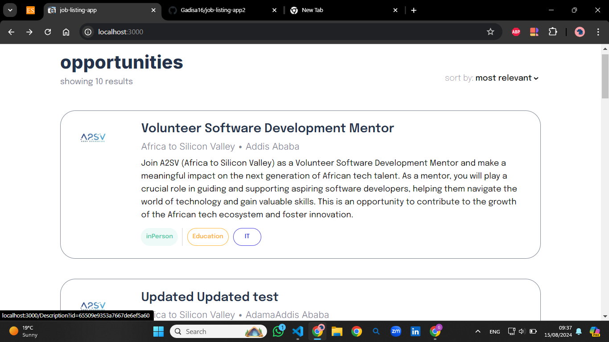

## Job Listing Application

This project is a fully responsive job listing application built with Next.js and TypeScript. It allows users to view job listings and see detailed descriptions when a job card is clicked. The job data is fetched from an external API.

## Features

- **Responsive Design**: The application is designed to be fully responsive, ensuring a smooth user experience on all device sizes.
- **Job Cards**: Each job card is dynamically generated using data fetched from an external API, displaying relevant information like the job title, company name, and location.
- **Detailed Job Descriptions**: Clicking on a job card navigates to a page with detailed information about the selected job.
- **API Data Handling**: The job data is fetched from a remote API (`https://akil-backend.onrender.com/opportunities/search`), showcasing how to integrate an external data source in a Next.js project.
- **Styled with Tailwind CSS**: The design closely follows the provided Figma file, utilizing Tailwind CSS for styling.

## Screenshots




## Getting Started

### Prerequisites

- Node.js
- npm or yarn

### Installation

1. Clone the repository:
   ```bash
   git clone https://github.com/Gadisa16/job-listing-app2.git
